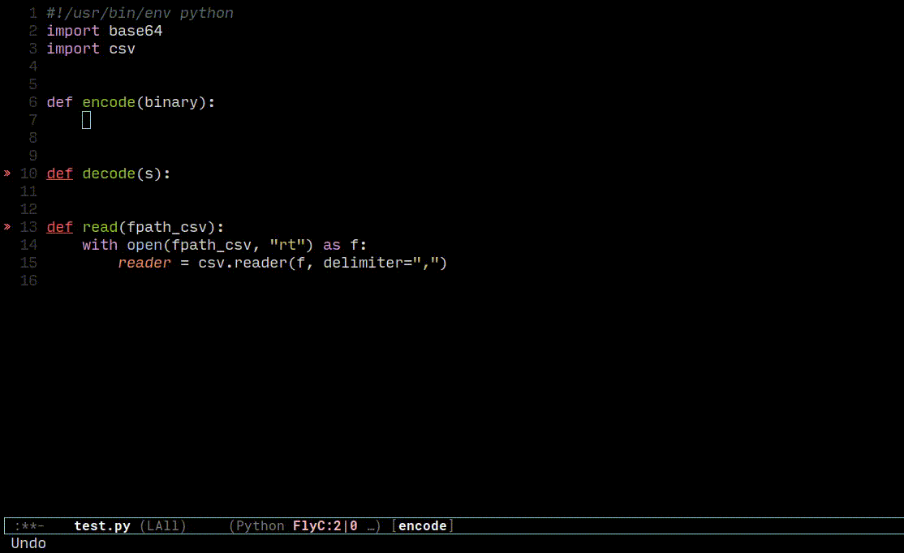

# gemini-code-complete.el


# Overview

gemini-code-completion.el is an Emacs package that provides code completion
functionality using Google Gemini. This package can complete code based on the
current cursor position or within a selected region.



# Features

- Code completion for the current buffer or a selected region.
- Uses Google Gemini to generate code suggestions.
- Optionally, append your prompt to customize the completion

# Installation

Prerequisites

- The google-gemini package version 0.1.0 or higher.

Steps

1. Ensure you have added MELPA repository in your Emacs configuration:

```
(require 'package)
(add-to-list 'package-archives '("melpa" . "https://melpa.org/packages/") t)
(package-initialize)
```

2. Install the dependent package, google-gemini:

```
(package-install 'google-gemini)
```

3. Download gemini-code-completion.el from
   [GitHub](https://github.com/shishimaru/gemini-code-completion.el) and place
   it in your `~/.emacs.d/lisp/` directory.

4. Add the following to your Emacs configuration to load the package:

```
(add-to-list 'load-path "~/.emacs.d/lisp/")
(require 'gemini-code-completion)
```

5. Set your API key published in free at [Google AI Studio](https://aistudio.google.com/app/apikey)
   to connect to Google Gemini

The API Key is used by a depending package
[google-gemini](https://github.com/emacs-openai/google-gemini) to send API requests to Gemini.

```
(setq google-gemini-key "YOUR_API_KEY_of_Google_AI_Studio")
```

# Usage

1. To trigger code completion for the current buffer or selected region, use the
   command:

```
M-x gemini-code-completion
```


2. To trigger code completion by indicating the detail what code you expect, use
   the command with a prefix key C-u

```
C-u M-x gemini-code-completion
```

3. It will generate code suggestions based on the context and insert
   the completion at the current cursor position.

# Functions

`gemini-code-completion`

This is the main function that triggers code completion using Google Gemini. It
operates on the current buffer or selected region, generates a completion, and
inserts it while preserving the original cursor position.

`gemini-code-completion-handler`

Handles the response from Google Gemini, extracting the completion text and inserting it at the appropriate location.

`gemini-code-completion-extract-completion`

Extracts and cleans the completion text from the response returned by Google Gemini.

`gemini-code-completion-clean-text`

Removes unwanted backquotes from the completion text.

# Customization

You can customize the default prompt used for code completion by modifying the
gemini-code-completion-default-prompt variable:

```
(defvar gemini-code-completion-default-prompt
  "Suggest only missing part to work as feature, at most just only 1 or 2 lines.
Must not exceed 2 lines in suggesting.
Take care indentation as well.


" "Default prompt to input into Google Gemini.")
```

# License

This program is free software: you can redistribute it and/or modify it under
the terms of the GNU General Public License as published by the Free Software
Foundation, either version 3 of the License, or (at your option) any later
version.

This program is distributed in the hope that it will be useful, but WITHOUT ANY
WARRANTY; without even the implied warranty of MERCHANTABILITY or FITNESS FOR A
PARTICULAR PURPOSE. See the GNU General Public License for more details.

You should have received a copy of the GNU General Public License along with
this program. If not, see http://www.gnu.org/licenses/.

# Author

Hitoshi Uchida

Email: hitoshi.uchida@gmail.com
